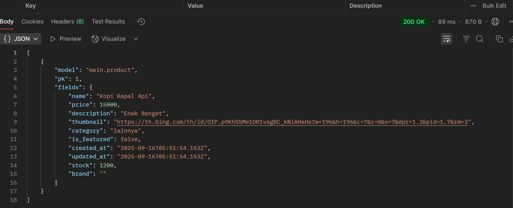
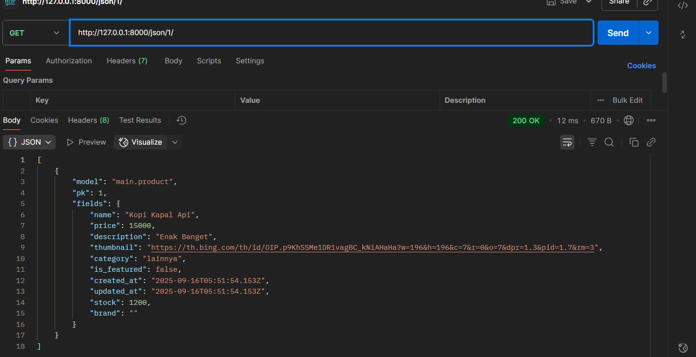
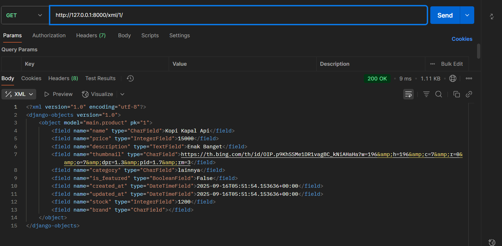

# Garuda Football Shop

**PWS:** https://rivaldy-putra-footballshop.pbp.cs.ui.ac.id/

## 1) Implementasi checklist (step-by-step)
1. **Proyek Django baru**  
   Membuat folder `footballshop`, membuat virtualenv, menulis `requirements.txt`, lalu `django-admin startproject footballshop .`.
2. **Membuat aplikasi `main`**  
   `python manage.py startapp main`, mendaftarkan `'main'` ke `INSTALLED_APPS`.
3. **Routing proyek → app**  
   Di `footballshop/urls.py` menambahkan `path('', include('main.urls'))`. Di `main/urls.py` memetakan root ke view `show_home`.
4. **Model `Product`**  
   Menambahkan model dengan 6 atribut wajib (`name`, `price`, `description`, `thumbnail`, `category`, `is_featured`) + atribut opsional (mis. `stock`, `brand`, `rating`). Lalu `makemigrations` dan `migrate`.
5. **View + Template**  
   Membuat fungsi `show_home` di `main/views.py` yang mengirim `context` berisi `app_name`, `student_name`, dan `student_class` ke `main/templates/home.html`. Template menampilkan tiga data tersebut.
6. **Deployment**  
   Menambahkan domain PWS ke `ALLOWED_HOSTS`, mengisi Environs `.env.prod` (PRODUCTION=True, SCHEMA=tugas_individu, DB_*), lalu `git push pws master`.
7. **README**  
   Menulis penjelasan langkah, bagan alur MVT, peran `settings.py`, migrasi, alasan memakai Django, dan feedback asdos.

## 2) Bagan request–response & kaitan berkas (MVT)
- Browser mengirim GET /
- project: footballshop/urls.py → include('main.urls')
- app: main/urls.py → path('', show_home)
- view: main/views.py::show_home
  - (opsional) ambil data dari main/models.py::Product
  - render('home.html', context)
- template: main/templates/home.html → HTML response ke browser

**Penjelasan singkat:** Saat pengguna membuka `http://.../`, browser mengirim permintaan **GET** ke path root (`/`). Django di level proyek (`footballshop/urls.py`) meneruskan URL root ke URL milik app `main` (`include('main.urls')`). Di level app (`main/urls.py`), pola `''` memetakan request ke fungsi **`show_home`**. View tersebut menyiapkan **context** (dan bila perlu membaca **Model** `Product`) lalu me-render **`home.html`**. Hasil render dikirim kembali ke browser sebagai **response** (HTML) sehingga halaman tampil.


**Kaitan berkas:** `urls.py` memetakan URL ke view; `views.py` menyiapkan logika & context; `models.py` menyimpan/ambil data; template `.html` menyajikan tampilan.

## (3) Peran `settings.py`
Pusat konfigurasi proyek: `INSTALLED_APPS`, `MIDDLEWARE`, `TEMPLATES`, `DATABASES` (via env var untuk dev/prod), `ALLOWED_HOSTS`, konfigurasi berkas statis, zona waktu/bahasa, dan integrasi pihak ketiga. Dengan memisahkan konfigurasi dari kode, proyek konsisten berjalan di lingkungan berbeda (lokal vs produksi).

## (4) Cara kerja migrasi database
Perubahan pada `models.py` dibuatkan **file migrasi** oleh `makemigrations`. Eksekusi migrasi ke DB dilakukan oleh `migrate` untuk membuat/mengubah tabel/kolom secara bertahap. Django menyimpan riwayat migrasi sehingga mudah dilacak dan di-*rollback* jika perlu.

## (5) Mengapa Django cocok untuk permulaan?
- **Batteries-included** (ORM, templating, admin, form, autentikasi, proteksi CSRF/XSS).
- **Struktur MVT jelas**, membantu memahami alur request → view → template.
- **Dokumentasi & komunitas besar**, stabil, dipakai luas di industri.
- **Produktif**: cepat menghasilkan aplikasi berjalan tanpa banyak konfigurasi awal.

## (6) Feedback untuk Asdos Tutorial 1
- Semoga lebih baik lagi dan bisa bekerja dengan baik disemester ini. Semoga ada komunikasi baik antara asdos dan saya agar memahami materi dan mendapat nilai terbaik.

# Footballshop — Tugas 3: Form & Data Delivery (Django)

Aplikasi **Football Shop** sederhana untuk katalog perlengkapan bola. Pada Tugas 3 ini ditambahkan **form tambah produk**, **halaman list & detail**, serta **endpoint data delivery** (JSON & XML, termasuk by ID).

> 👉 **URL PWS (deployment)**: `https://rivaldy-putra-footballnews.pbp.cs.ui.ac.id/` 

---

## ✨ Fitur
- Daftar produk + tombol **Add** (menuju form) dan **Detail** (halaman detail).
- Form tambah produk (validasi Django Forms + **CSRF**).
- Endpoint data: **JSON**, **XML**, **JSON by ID**, **XML by ID**.
- Admin Django untuk CRUD cepat.

---

## 🧱 Model (app `main`)

`Product` — memenuhi 6 field wajib tugas + tambahan waktu dibuat.

| Field         | Type           | Keterangan                                      |
|---------------|----------------|-------------------------------------------------|
| `name`        | CharField      | Nama item (wajib)                               |
| `price`       | IntegerField   | Harga (wajib)                                   |
| `description` | TextField      | Deskripsi (wajib)                               |
| `thumbnail`   | URLField       | URL gambar (wajib)                              |
| `category`    | CharField      | Kategori (wajib)                                |
| `is_featured` | BooleanField   | Status unggulan (wajib)                         |
| `created_at`  | DateTimeField  | `auto_now_add=True` *(ditambahkan di Tugas 3)*  |
|  `stock`      | IntegerField   | Opsional                                        |
|  `brand`      | CharField      | Opsional                                        |

> Saat menambah `created_at` pada tabel yang sudah berisi data, **makemigrations** akan meminta default—tekan **Enter** untuk `timezone.now`.

---

## 🗂️ Templates

Folder: `main/templates/`

- `base.html` — layout utama (``).
- `product_list.html` — daftar produk + tombol **Add** dan **Detail**.
- `product_detail.html` — halaman detail produk.
- `create_news.html` — dipakai sebagai **form tambah produk** 
- 👉 `home.html`, `main.html`, `news_detail.html` — tersisa dari tugas/tutor sebelumnya (tidak dipakai langsung di flow Tugas 3, boleh dibiarkan).

---

## 🔌 URL Routing

**`footballshop/urls.py`**
```python
from django.contrib import admin
from django.urls import path, include

urlpatterns = [
    path("admin/", admin.site.urls),
    path("", include("main.urls")),
]
```
## 🧩 Jawaban Pertanyaan Teori

### 1. Mengapa kita memerlukan data delivery dalam pengimplementasian sebuah platform?
Data delivery memungkinkan backend dan frontend berkomunikasi dengan format standar seperti JSON atau XML. Dengan begitu, data bisa diakses tidak hanya oleh web browser, tetapi juga oleh aplikasi mobile atau sistem lain. Hal ini membuat platform lebih fleksibel, reusable, dan mudah diintegrasikan.

---

### 2. Menurutmu, mana yang lebih baik antara XML dan JSON? Mengapa JSON lebih populer dibandingkan XML?
Secara umum, JSON lebih baik digunakan untuk aplikasi modern karena:
- Lebih ringkas dan mudah dibaca manusia.
- Lebih cepat di-*parse* oleh komputer.
- Native di JavaScript sehingga cocok untuk web dan REST API.

XML masih unggul untuk dokumen yang membutuhkan validasi struktur kompleks, tetapi JSON lebih populer karena ringan dan sesuai kebutuhan integrasi aplikasi saat ini.
# Football Shop

## Bukti Endpoint Data Delivery (Local)

### JSON (list) — http://127.0.0.1:8000/json/


### JSON by ID — http://127.0.0.1:8000/json/1/


### XML (list) — http://127.0.0.1:8000/xml/


### XML by ID — http://127.0.0.1:8000/xml/1/


---

### 3. Jelaskan fungsi dari method `is_valid()` pada form Django dan mengapa kita membutuhkan method tersebut?
`form.is_valid()` menjalankan validasi field berdasarkan aturan model dan form (misalnya: required, tipe data, panjang maksimum). Jika valid, ia mengisi `form.cleaned_data` yang aman untuk diproses lebih lanjut.  
Tanpa validasi ini, aplikasi bisa menyimpan data yang salah/berbahaya ke database.

---

### 4. Mengapa kita membutuhkan `csrf_token` saat membuat form di Django? Apa yang dapat terjadi jika kita tidak menambahkan `csrf_token` pada form Django? Bagaimana hal tersebut dapat dimanfaatkan oleh penyerang?
`` mencegah serangan **Cross-Site Request Forgery (CSRF)**, yaitu ketika penyerang membuat user tanpa sadar mengirimkan permintaan berbahaya (misalnya delete data) ke server.  
Tanpa token ini, server tidak bisa membedakan mana request asli dari form dan mana request palsu buatan attacker.

---

### 5. Jelaskan bagaimana cara kamu mengimplementasikan checklist di atas secara step-by-step!
1. Membuat model `Product` dengan field wajib + tambahan `created_at`.  
2. Menjalankan `makemigrations` dan `migrate`.  
3. Membuat `ProductForm` dengan Django ModelForm.  
4. Membuat views untuk list, detail, create, serta JSON/XML endpoints.  
5. Routing di `main/urls.py`.  
6. Membuat templates: `base.html`, `product_list.html`, `product_detail.html`, `create_news.html`.  
7. Menambahkan tombol **Add** dan **Detail** di halaman list.  
8. Uji dengan Postman (JSON, XML, JSON by ID, XML by ID).  
9. Deploy ke PWS dan update README.md.

---

### 6. Feedback untuk asdos tutorial 2
Materi tutorial sudah cukup jelas dan membantu memahami konsep form dan data delivery. Akan lebih baik jika disertakan lebih banyak contoh kasus error umum (misalnya CSRF, migrasi, atau template error) supaya mahasiswa bisa lebih siap menghadapi debugging.


# Footballshop — Tugas 4: Implementasi Autentikasi, Session, dan Cookies pada Django

---

## 1. Apa itu `Django AuthenticationForm`? Kelebihan & Kekurangan

`AuthenticationForm` adalah form **login bawaan Django** yang memvalidasi pasangan `username`–`password` terhadap backend autentikasi Django dan mengembalikan instance `User` jika kredensial valid.

**Kelebihan**

* **Siap pakai**: validasi username/password + status user tanpa bikin dari nol.
* **Terintegrasi** dengan sistem auth & hashing password Django.
* **Aman secara default** dan mudah dipakai dengan CSRF + session.

**Kekurangan**

* **Kasus standar saja** (username+password). SSO/OTP/OAuth perlu kustomisasi lain.
* **Tampilan sederhana**: perlu styling sendiri di template.
* **Kustomisasi field/pesan error** lebih enak via subclassing.

---

## 2. Autentikasi vs Otorisasi & Implementasi di Django

* **Autentikasi** = memastikan **siapa** pengguna (proses login).
* **Otorisasi** = memastikan **apa yang boleh** dilakukan pengguna (izin/role).

**Di Django**

* **Autentikasi**: `authenticate()`, `login()`, `logout()`, `AuthenticationForm`, `AuthenticationMiddleware`.
* **Otorisasi**: Permissions & Groups (`user.has_perm(...)`, `is_staff`, `is_superuser`), decorator `@permission_required`, serta pembatasan akses dasar via `@login_required`.

---

## 3. Session vs Cookies untuk menyimpan state

| Aspek       | Cookies                                            | Sessions                                          |
| ----------- | -------------------------------------------------- | ------------------------------------------------- |
| Disimpan di | **Client** (browser)                               | **Server**; client pegang **sessionid** di cookie |
| Kapasitas   | Kecil (±4KB)                                       | Fleksibel (DB/cache/file)                         |
| Keamanan    | Bisa dibaca/diubah client (perlu signing/enkripsi) | Lebih aman (data sensitif tetap di server)        |
| Overhead    | Terkirim di setiap request                         | Perlu lookup storage server                       |
| Use case    | Preferensi ringan & non-sensitif                   | Login, keranjang, state aplikasi penting          |

**Praktik baik**: simpan informasi penting di **session**, bukan langsung di cookie.

---

## 4. Keamanan Cookies: Risiko & Mitigasi Django

**Cookies tidak otomatis “aman”.** Risiko: **XSS** (mencuri cookie), **session fixation**, **MITM** jika non-HTTPS, manipulasi nilai cookie.

**Mitigasi Django**

* **CSRF protection** bawaan (``).
* Opsi cookie:

  * `SESSION_COOKIE_HTTPONLY = True` (default) → tak bisa diakses JavaScript.
  * `SESSION_COOKIE_SECURE = True`, `CSRF_COOKIE_SECURE = True` → hanya via HTTPS.
  * `SESSION_COOKIE_SAMESITE = 'Lax'/'Strict'` (dan untuk CSRF).
* **Signed cookies** jika menyimpan data di cookie.
* **Password hashing** kuat & auth backend.
* (Opsional) **Session rotation** setelah login.

---

## 5. Implementasi (Step-by-Step) di Proyek *footballshop*

> Ringkas sesuai yang benar-benar dikerjakan.

### 5.1. Register

* **View**

  ```python
  # main/views.py
  from django.contrib.auth.forms import UserCreationForm
  from django.contrib import messages
  from django.shortcuts import render, redirect

  def register(request):
      form = UserCreationForm()
      if request.method == "POST":
          form = UserCreationForm(request.POST)
          if form.is_valid():
              form.save()
              messages.success(request, "Your account has been successfully created!")
              return redirect("main:login")
      return render(request, "register.html", {"form": form})
  ```
* **URL**

  ```python
  # main/urls.py
  from django.urls import path
  from .views import register

  app_name = "main"
  urlpatterns = [
      path("register/", register, name="register"),
      # ...
  ]
  ```
* **Template**: `main/templates/register.html` (pakai `{{ form.as_table }}` + ``).

### 5.2. Login (+ simpan cookie `last_login`)

* **View**

  ```python
  # main/views.py
  import datetime
  from django.contrib.auth.forms import AuthenticationForm
  from django.contrib.auth import login
  from django.http import HttpResponseRedirect
  from django.urls import reverse
  from django.shortcuts import render

  def login_user(request):
      if request.method == "POST":
          form = AuthenticationForm(data=request.POST)
          if form.is_valid():
              user = form.get_user()
              login(request, user)
              response = HttpResponseRedirect(reverse("main:show_products"))
              response.set_cookie("last_login", str(datetime.datetime.now()))
              return response
      else:
          form = AuthenticationForm(request)
      return render(request, "login.html", {"form": form})
  ```
* **URL**

  ```python
  # main/urls.py
  from .views import login_user
  urlpatterns += [ path("login/", login_user, name="login") ]
  ```
* **Template**: `main/templates/login.html`.

### 5.3. Logout (hapus cookie)

* **View**

  ```python
  # main/views.py
  from django.contrib.auth import logout
  from django.http import HttpResponseRedirect
  from django.urls import reverse

  def logout_user(request):
      logout(request)
      response = HttpResponseRedirect(reverse("main:login"))
      response.delete_cookie("last_login")
      return response
  ```
* **URL**

  ```python
  urlpatterns += [ path("logout/", logout_user, name="logout") ]
  ```

### 5.4. Restriksi halaman (main & detail)

* **Decorator**

  ```python
  # main/views.py
  from django.contrib.auth.decorators import login_required
  from django.shortcuts import get_object_or_404, render

  @login_required(login_url="/login")
  def show_products(request):
      # ... siapkan context (list produk + last_login)
      return render(request, "products.html", context)

  @login_required(login_url="/login")
  def product_detail(request, id):
      product = get_object_or_404(Product, pk=id)
      return render(request, "product_detail.html", {"product": product})
  ```

### 5.5. Tampilkan `last_login` di halaman utama

* **Context**

  ```python
  context = {
      # ...
      "last_login": request.COOKIES.get("last_login", "Never"),
  }
  ```
* **Template**: `Sesi terakhir login: {{ last_login }}`.

### 5.6. Hubungkan model dengan User (data milik pembuat)

* **Model**

  ```python
  # main/models.py
  from django.db import models
  from django.contrib.auth.models import User

  class Product(models.Model):
      user = models.ForeignKey(User, on_delete=models.CASCADE, null=True, blank=True)
      title = models.CharField(max_length=120)
      price = models.PositiveIntegerField(default=0)
      description = models.TextField(blank=True)
      created_at = models.DateTimeField(auto_now_add=True)
  ```
* **Migrasi**

  ```bash
  python manage.py makemigrations
  python manage.py migrate
  ```
* **Create view**: isi `user` saat simpan

  ```python
  obj = form.save(commit=False)
  obj.user = request.user
  obj.save()
  ```

### 5.7. Filter “All” vs “My”

```python
filter_type = request.GET.get("filter", "all")
if filter_type == "my":
    products = Product.objects.filter(user=request.user)
else:
    products = Product.objects.all()
```

Tambahkan dua tombol:

```html
<a href="?filter=all"><button>All Items</button></a>
<a href="?filter=my"><button>My Items</button></a>
```

### 5.8. Perapihan URL name & template (mengatasi error)

* Ganti semua `''` → `''` agar tidak `NoReverseMatch`.
* Pastikan file template **ada**:

  * `products.html`, `product_detail.html`, `create_product.html`, `login.html`, `register.html`
* Contoh navbar di `base.html`:

  ```html
  <a href="" class="btn">Home</a>
  <a href="" class="btn btn-primary">+ Add</a>
  ```

### 5.9. (Opsional) Selenium functional test

* Tambahkan `selenium` di `requirements.txt`.
* Buat `LiveServerTestCase` di `main/tests.py` untuk uji alur login/register/create/detail/logout.

---
# Tugas 5: Desain Web menggunakan HTML, CSS dan Framework CSS

## Daftar Isi

* [1. Urutan Prioritas CSS Selector (Specificity)](#1-urutan-prioritas-css-selector-specificity)
* [2. Pentingnya Responsive Design + Contoh](#2-pentingnya-responsive-design--contoh)
* [3. Margin vs Border vs Padding (Box Model)](#3-margin-vs-border-vs-padding-box-model)
* [4. Flexbox & Grid: Konsep dan Kegunaan](#4-flexbox--grid-konsep-dan-kegunaan)
* [5. Implementasi Step-by-Step di Proyek](#5-implementasi-step-by-step-di-proyek)

---

## 1. Urutan Prioritas CSS Selector (Specificity)

**Prioritas (dari tertinggi ke terendah):**

1. `!important` pada deklarasi (hindari kecuali darurat).
2. **Inline style** pada elemen: `<div style="color:red">`
3. **ID selector**: `#header`
4. **Class / attribute / pseudo-class**: `.btn`, `[type="text"]`, `:hover`
5. **Element / pseudo-element**: `h1`, `p`, `::before`
6. **Tiebreaker**: jika specificity sama, **aturan yang ditulis paling akhir** menang.

> Catatan: angka “skor” sering dibayangkan (misal 1000/100/10/1) hanya untuk **mengilustrasikan** perbandingan, bukan aturan resmi.

**Contoh:**

```html
<h1 id="title" class="heading">Hello</h1>
```

```css
h1 { color: black; }            /* element */
.heading { color: blue; }       /* class */
#title { color: green; }        /* id */
h1#title.heading { color: gray; } /* kombinasi: lebih spesifik */
h1#title.heading { color: purple !important; } /* paling kuat */
```

Hasil akhir: **ungu** (karena `!important`).

---

## 2. Pentingnya Responsive Design + Contoh

**Kenapa penting:**

* **Multi-device**: layar HP, tablet, laptop, monitor besar—semua harus nyaman dipakai.
* **UX & konversi**: navigasi mudah → bounce rate turun, pembelian naik.
* **Aksesibilitas & SEO**: Google memprioritaskan mobile-friendly; pengguna dengan kebutuhan khusus terbantu.
* **Maintainability**: satu basis kode untuk semua ukuran layar.

**Contoh aplikasi yang sudah menerapkan responsive:**

* **GitHub** (dashboard, repositori, diffs menyesuaikan lebar layar).
* **Banyak e-commerce modern**: halaman produk & grid katalog beradaptasi (kartu mengecil, kolom berkurang).

**Contoh aplikasi yang belum/kurang responsive:**

* **Situs lama “fixed-width”** (mis. layout 960px statis): di HP harus zoom/scroll horizontal; tombol kecil sulit ditekan.

**Snippet dasar responsive:**

```html
<!-- Tambahkan pada <head> -->
<meta name="viewport" content="width=device-width, initial-scale=1">
```

```css
/* Mobile-first */
.card-grid { display: grid; grid-template-columns: 1fr; gap: 12px; }

@media (min-width: 640px) {  /* tablet kecil */
  .card-grid { grid-template-columns: repeat(2, 1fr); }
}

@media (min-width: 1024px) { /* desktop */
  .card-grid { grid-template-columns: repeat(4, 1fr); }
}
```

---

## 3. Margin vs Border vs Padding (Box Model)

* **Padding**: ruang **di dalam** border, mengelilingi konten.
* **Border**: garis pembatas di **antara** padding dan margin.
* **Margin**: ruang **di luar** border, memisahkan elemen dari elemen lain.

```
[ margin ]
  [ border ]
    [ padding ]
      [ content ]
```

**Implementasi:**

```css
.box {
  /* padding: jarak konten ke border */
  padding: 16px 24px;

  /* border: garis pembatas */
  border: 2px solid #e5e7eb;
  border-radius: 8px;

  /* margin: jarak ke elemen lain */
  margin: 12px 0;
}
```

**Tip penting (`box-sizing`)**:

```css
/* Agar width/height sudah termasuk padding+border (lebih mudah dihitung) */
* { box-sizing: border-box; }
```

---

## 4. Flexbox & Grid: Konsep dan Kegunaan

### Flexbox (tata letak **1 dimensi**: baris **atau** kolom)

* **Cocok untuk**: navbar, toolbar, alignment card secara horizontal, tombol CTA berjejer.
* **Konsep**: container “flex” mengatur **main axis** (horizontal default) & **cross axis** (vertikal).
* **Properti utama (container)**: `display:flex; gap; justify-content; align-items; flex-wrap;`
* **Properti item**: `flex-grow; flex-shrink; flex-basis; align-self; order;`

**Contoh: navbar & tombol:**

```css
.nav {
  display: flex;
  align-items: center;     /* vertikal tengah */
  justify-content: space-between; /* kiri-kanan */
  gap: 12px;
  padding: 12px 16px;
}
.actions {
  display: flex;
  gap: 8px;
  flex-wrap: wrap;         /* biar turun baris di layar kecil */
}
```

### Grid (tata letak **2 dimensi**: baris **dan** kolom)

* **Cocok untuk**: grid produk, dashboard, kompleks layout halaman.
* **Properti utama**: `display:grid; grid-template-columns; grid-template-rows; gap; grid-area;`
* **Kekuatan**: kontrol area 2D, mudah buat layout responsif dengan fr unit & repeat.

**Contoh: katalog produk responsif:**

```css
.products {
  display: grid;
  grid-template-columns: repeat(2, 1fr); /* mobile */
  gap: 12px;
}
@media (min-width: 768px) { .products { grid-template-columns: repeat(3, 1fr); } }
@media (min-width: 1024px){ .products { grid-template-columns: repeat(4, 1fr); } }
```

**Kapan pakai apa?**

* **Flexbox**: urutan linier satu arah (row/column), alignment & distribusi ruang antar item.
* **Grid**: susun elemen pada **dua dimensi** (baris+kolom) dengan kontrol area yang presisi.

---

## 5. Implementasi Step-by-Step di Proyek

> Contoh alur **mobile-first** yang bisa kamu terapkan pada aplikasi (mis. toko olahraga).

### Step 0 — Struktur & “wiring”

* Pastikan file CSS global terhubung:

  ```html
  <link rel="stylesheet" href="/static/css/app.css">
  <meta name="viewport" content="width=device-width, initial-scale=1">
  ```
* Aktifkan `box-sizing` dan variabel warna/spacing jika perlu.

  ```css
  * { box-sizing: border-box; }
  :root { --space: 12px; --brand: #0ea5e9; }
  ```

### Step 1 — Terapkan **Box Model** dengan sadar

* Buat komponen kartu yang rapi jaraknya:

  ```css
  .card { padding: 16px; border: 1px solid #e5e7eb; border-radius: 10px; margin: 12px 0; }
  .card h3 { margin: 0 0 8px; }
  ```
* Cek di DevTools: pastikan padding/border/margin sesuai, tidak ada scroll horizontal.

### Step 2 — Layout dasar dengan **Flexbox**

* Header & navbar:

  ```css
  header.nav { display:flex; align-items:center; justify-content:space-between; gap:12px; padding:12px 16px; }
  .nav .menu { display:flex; gap:8px; flex-wrap:wrap; }
  ```
* CTA sticky di PDP:

  ```css
  .sticky-cta { position: sticky; bottom: 0; display:flex; gap:8px; padding: 12px; background:#fff; border-top:1px solid #eee; }
  ```

### Step 3 — Grid untuk **katalog produk**

```css
.products { display:grid; grid-template-columns: 1fr; gap: 12px; }
@media (min-width: 640px) { .products { grid-template-columns: repeat(2, 1fr); } }
@media (min-width: 1024px){ .products { grid-template-columns: repeat(4, 1fr); } }
```

### Step 4 — **Specificity hygiene**

* Tulis selector dari **umum → spesifik**.
* Hindari bertumpuk ID & `!important`. Jika butuh override, pakai **urutan file** atau tingkatkan selector secara wajar.
* Contoh prioritas aman:

  ```css
  .btn { background: var(--brand); }
  .btn.primary { background: #0284c7; }  /* lebih spesifik dari .btn */
  ```

### Step 5 — **Responsive design** (media queries)

* Mobile-first; tambah breakpoints seperlunya:

  ```css
  /* Base = mobile */
  .sidebar { display:none; }

  @media (min-width: 1024px) {
    .layout { display:grid; grid-template-columns: 240px 1fr; gap: 16px; }
    .sidebar { display:block; }
  }
  ```
* Uji di DevTools: iPhone SE, iPad, laptop 1366px.

### Step 6 — Komponen utilitas (spacing & gap)

* Konsistenkan jarak antarelemen:

  ```css
  .stack > * + * { margin-top: var(--space); }        /* vertical stack */
  .inline { display:flex; flex-wrap:wrap; gap: var(--space); } /* horizontal */
  ```

### Step 7 — Test aksesibilitas cepat

* **Kontras** tombol vs background (gunakan DevTools > Accessibility).
* Fokus keyboard terlihat (`:focus-visible`), alt pada gambar produk.

### Step 8 — Refactor & dokumentasi

* Pisah file: `components/`, `layout/`, `pages/`.
* Dokumentasikan pola (contoh class & snippet) di README agar tim konsisten.
## Tugas 6: Javascript dan AJAX

### 1) Perbedaan **Synchronous** vs **Asynchronous** Request

| Aspek             | Synchronous (Sync)                                                     | Asynchronous (Async/AJAX)                                               |
| ----------------- | ---------------------------------------------------------------------- | ----------------------------------------------------------------------- |
| Cara kerja        | Browser kirim request lalu **menunggu** HTML penuh, halaman **reload** | Browser kirim request di belakang layar (XHR/`fetch`), **tanpa reload** |
| Data balik        | HTML utuh                                                              | Umumnya **JSON** (atau fragment HTML)                                   |
| Dampak UX         | Terasa “pindah halaman”, konteks sering hilang                         | Interaksi **cepat & mulus**, hanya bagian perlu yang di-update          |
| Konsumsi jaringan | Lebih besar (HTML + assets re-render)                                  | Lebih hemat (payload kecil)                                             |

Ringkasnya: **sync = blocking & reload**, **async = non-blocking & partial update**.

---

### 2) Alur Kerja AJAX di Django (Request–Response)

1. **Event UI** (klik/submit) memicu `fetch()` di front-end.
2. **URL routing** di `urls.py` mengarah ke **view AJAX** (mis. `products_json`).
3. **Proteksi CSRF**: Django memverifikasi `X-CSRFToken` untuk method non-GET.
4. **View** memproses (validasi form, DB), lalu mengembalikan **JsonResponse**.
5. **Front-end** menerima JSON → **memperbarui DOM** (render kartu, tutup modal, toast) **tanpa reload**.

> Sketsa:

```
UI event ─▶ fetch() ─▶ urls.py ─▶ views.py (validasi+DB+CSRF) ─▶ JsonResponse ─▶ JS update DOM
```

---

### 3) Keuntungan AJAX dibanding Render Biasa

* **Performa & UX**: cepat karena tidak memuat ulang halaman penuh.
* **Efisien**: payload hanya **data** (JSON), bukan template besar.
* **Interaktif**: modal, inline edit, infinite scroll, live validation.
* **Reusable**: endpoint JSON bisa dipakai komponen lain atau aplikasi lain.

---

### 4) Keamanan Login & Register via AJAX (Django)

Checklist yang dipakai pada proyek ini:

* **CSRF wajib**
  Tambahkan token di template:

  ```html
  <meta name="csrf-token" content="{{ csrf_token }}">
  ```

  Kirim lewat header saat `POST`:

  ```js
  fetch("/ajax/login/", {
    method: "POST",
    headers: {
      "X-CSRFToken": getCSRFToken(),           // diambil dari cookie/meta
      "Content-Type": "application/x-www-form-urlencoded"
    },
    body: new URLSearchParams({username, password})
  });
  ```
* **Validasi server-side** tetap (gunakan `AuthenticationForm` / `UserCreationForm`).
* **Gunakan API auth Django** (`login()`, `logout()`), jangan set session manual.
* **HTTPS** di production + cookie aman:
  `SESSION_COOKIE_SECURE=True`, `CSRF_COOKIE_SECURE=True`, `SESSION_COOKIE_HTTPONLY=True`.
* **Authorization**: operasi sensitif (edit/hapus) hanya untuk **owner** atau **staff**.
* (Opsional) **Rate limiting** endpoint auth untuk cegah brute force.

---

### 5) Dampak AJAX terhadap User Experience

* **Respons cepat**: Create/Edit/Delete terasa instan (modal + toast).
* **Konteks terjaga**: pengguna tidak kehilangan posisi/scroll.
* **State jelas**: bisa tampilkan **loading / empty / error** lokal.
* **Lebih “app-like”**: pengalaman menyerupai aplikasi desktop/mobile.

---

### 6) Ringkasan Implementasi pada Proyek

* Endpoint AJAX:
  `GET /ajax/products/`, `POST /ajax/products/create/`, `POST /ajax/products/<id>/update/`, `POST /ajax/products/<id>/delete/`, `POST /ajax/login/`, `POST /ajax/register/`, `POST /ajax/logout/`.
* View mengembalikan **JSON** (menggunakan `JsonResponse`) dan memeriksa **izin** (owner/staff).
* Front-end memakai **fetch + CSRF header**, men-render list produk di container, serta modal **Create/Edit/Delete** tanpa reload.

---


