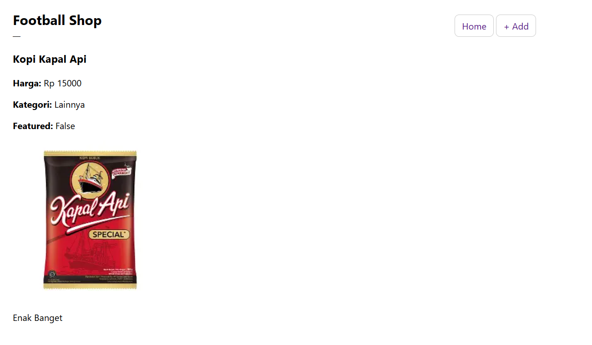
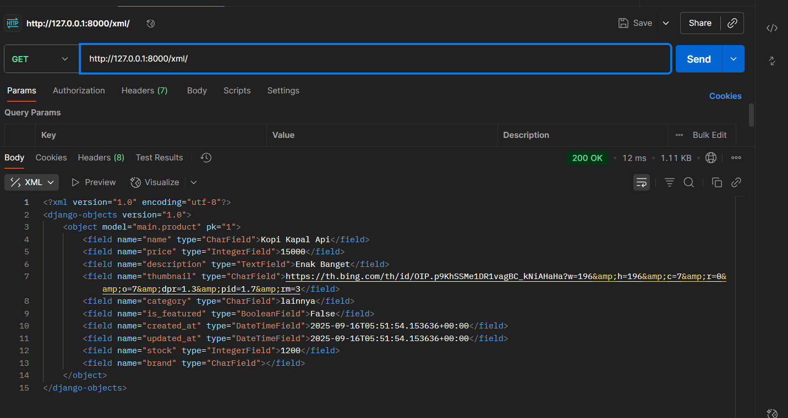
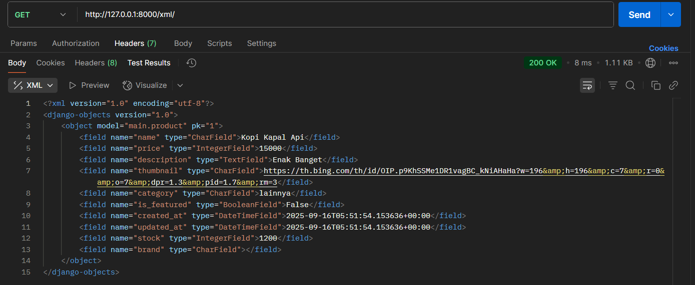

# Garuda Football Shop

**PWS:** https://rivaldy-putra-footballshop.pbp.cs.ui.ac.id/

## 1) Implementasi checklist (step-by-step)
1. **Proyek Django baru**  
   Membuat folder `footballshop`, membuat virtualenv, menulis `requirements.txt`, lalu `django-admin startproject footballshop .`.
2. **Membuat aplikasi `main`**  
   `python manage.py startapp main`, mendaftarkan `'main'` ke `INSTALLED_APPS`.
3. **Routing proyek → app**  
   Di `footballshop/urls.py` menambahkan `path('', include('main.urls'))`. Di `main/urls.py` memetakan root ke view `show_home`.
4. **Model `Product`**  
   Menambahkan model dengan 6 atribut wajib (`name`, `price`, `description`, `thumbnail`, `category`, `is_featured`) + atribut opsional (mis. `stock`, `brand`, `rating`). Lalu `makemigrations` dan `migrate`.
5. **View + Template**  
   Membuat fungsi `show_home` di `main/views.py` yang mengirim `context` berisi `app_name`, `student_name`, dan `student_class` ke `main/templates/home.html`. Template menampilkan tiga data tersebut.
6. **Deployment**  
   Menambahkan domain PWS ke `ALLOWED_HOSTS`, mengisi Environs `.env.prod` (PRODUCTION=True, SCHEMA=tugas_individu, DB_*), lalu `git push pws master`.
7. **README**  
   Menulis penjelasan langkah, bagan alur MVT, peran `settings.py`, migrasi, alasan memakai Django, dan feedback asdos.

## 2) Bagan request–response & kaitan berkas (MVT)
- Browser mengirim GET /
- project: footballshop/urls.py → include('main.urls')
- app: main/urls.py → path('', show_home)
- view: main/views.py::show_home
  - (opsional) ambil data dari main/models.py::Product
  - render('home.html', context)
- template: main/templates/home.html → HTML response ke browser

**Penjelasan singkat:** Saat pengguna membuka `http://.../`, browser mengirim permintaan **GET** ke path root (`/`). Django di level proyek (`footballshop/urls.py`) meneruskan URL root ke URL milik app `main` (`include('main.urls')`). Di level app (`main/urls.py`), pola `''` memetakan request ke fungsi **`show_home`**. View tersebut menyiapkan **context** (dan bila perlu membaca **Model** `Product`) lalu me-render **`home.html`**. Hasil render dikirim kembali ke browser sebagai **response** (HTML) sehingga halaman tampil.


**Kaitan berkas:** `urls.py` memetakan URL ke view; `views.py` menyiapkan logika & context; `models.py` menyimpan/ambil data; template `.html` menyajikan tampilan.

## (3) Peran `settings.py`
Pusat konfigurasi proyek: `INSTALLED_APPS`, `MIDDLEWARE`, `TEMPLATES`, `DATABASES` (via env var untuk dev/prod), `ALLOWED_HOSTS`, konfigurasi berkas statis, zona waktu/bahasa, dan integrasi pihak ketiga. Dengan memisahkan konfigurasi dari kode, proyek konsisten berjalan di lingkungan berbeda (lokal vs produksi).

## (4) Cara kerja migrasi database
Perubahan pada `models.py` dibuatkan **file migrasi** oleh `makemigrations`. Eksekusi migrasi ke DB dilakukan oleh `migrate` untuk membuat/mengubah tabel/kolom secara bertahap. Django menyimpan riwayat migrasi sehingga mudah dilacak dan di-*rollback* jika perlu.

## (5) Mengapa Django cocok untuk permulaan?
- **Batteries-included** (ORM, templating, admin, form, autentikasi, proteksi CSRF/XSS).
- **Struktur MVT jelas**, membantu memahami alur request → view → template.
- **Dokumentasi & komunitas besar**, stabil, dipakai luas di industri.
- **Produktif**: cepat menghasilkan aplikasi berjalan tanpa banyak konfigurasi awal.

## (6) Feedback untuk Asdos Tutorial 1
- Semoga lebih baik lagi dan bisa bekerja dengan baik disemester ini. Semoga ada komunikasi baik antara asdos dan saya agar memahami materi dan mendapat nilai terbaik.

# Footballshop — Tugas 3: Form & Data Delivery (Django)

Aplikasi **Football Shop** sederhana untuk katalog perlengkapan bola. Pada Tugas 3 ini ditambahkan **form tambah produk**, **halaman list & detail**, serta **endpoint data delivery** (JSON & XML, termasuk by ID).

> 👉 **URL PWS (deployment)**: `https://rivaldy-putra-footballnews.pbp.cs.ui.ac.id/` 

---

## ✨ Fitur
- Daftar produk + tombol **Add** (menuju form) dan **Detail** (halaman detail).
- Form tambah produk (validasi Django Forms + **CSRF**).
- Endpoint data: **JSON**, **XML**, **JSON by ID**, **XML by ID**.
- Admin Django untuk CRUD cepat.

---

## 🧱 Model (app `main`)

`Product` — memenuhi 6 field wajib tugas + tambahan waktu dibuat.

| Field         | Type           | Keterangan                                      |
|---------------|----------------|-------------------------------------------------|
| `name`        | CharField      | Nama item (wajib)                               |
| `price`       | IntegerField   | Harga (wajib)                                   |
| `description` | TextField      | Deskripsi (wajib)                               |
| `thumbnail`   | URLField       | URL gambar (wajib)                              |
| `category`    | CharField      | Kategori (wajib)                                |
| `is_featured` | BooleanField   | Status unggulan (wajib)                         |
| `created_at`  | DateTimeField  | `auto_now_add=True` *(ditambahkan di Tugas 3)*  |
| 👉 `stock`    | IntegerField   | Opsional                                        |
| 👉 `brand`    | CharField      | Opsional                                        |

> Saat menambah `created_at` pada tabel yang sudah berisi data, **makemigrations** akan meminta default—tekan **Enter** untuk `timezone.now`.

---

## 🗂️ Templates

Folder: `main/templates/`

- `base.html` — layout utama (``).
- `product_list.html` — daftar produk + tombol **Add** dan **Detail**.
- `product_detail.html` — halaman detail produk.
- `create_news.html` — dipakai sebagai **form tambah produk** 
- 👉 `home.html`, `main.html`, `news_detail.html` — tersisa dari tugas/tutor sebelumnya (tidak dipakai langsung di flow Tugas 3, boleh dibiarkan).

---

## 🔌 URL Routing

**`footballshop/urls.py`**
```python
from django.contrib import admin
from django.urls import path, include

urlpatterns = [
    path("admin/", admin.site.urls),
    path("", include("main.urls")),
]

## 🧩 Jawaban Pertanyaan Teori

### 1. Mengapa kita memerlukan data delivery dalam pengimplementasian sebuah platform?
Data delivery memungkinkan backend dan frontend berkomunikasi dengan format standar seperti JSON atau XML. Dengan begitu, data bisa diakses tidak hanya oleh web browser, tetapi juga oleh aplikasi mobile atau sistem lain. Hal ini membuat platform lebih fleksibel, reusable, dan mudah diintegrasikan.

---

### 2. Menurutmu, mana yang lebih baik antara XML dan JSON? Mengapa JSON lebih populer dibandingkan XML?
Secara umum, JSON lebih baik digunakan untuk aplikasi modern karena:
- Lebih ringkas dan mudah dibaca manusia.
- Lebih cepat di-*parse* oleh komputer.
- Native di JavaScript sehingga cocok untuk web dan REST API.

XML masih unggul untuk dokumen yang membutuhkan validasi struktur kompleks, tetapi JSON lebih populer karena ringan dan sesuai kebutuhan integrasi aplikasi saat ini.
# Football Shop


### Halaman Home


### Data XML


### Data JSON Deploy


---

### 3. Jelaskan fungsi dari method `is_valid()` pada form Django dan mengapa kita membutuhkan method tersebut?
`form.is_valid()` menjalankan validasi field berdasarkan aturan model dan form (misalnya: required, tipe data, panjang maksimum). Jika valid, ia mengisi `form.cleaned_data` yang aman untuk diproses lebih lanjut.  
Tanpa validasi ini, aplikasi bisa menyimpan data yang salah/berbahaya ke database.

---

### 4. Mengapa kita membutuhkan `csrf_token` saat membuat form di Django? Apa yang dapat terjadi jika kita tidak menambahkan `csrf_token` pada form Django? Bagaimana hal tersebut dapat dimanfaatkan oleh penyerang?
`` mencegah serangan **Cross-Site Request Forgery (CSRF)**, yaitu ketika penyerang membuat user tanpa sadar mengirimkan permintaan berbahaya (misalnya delete data) ke server.  
Tanpa token ini, server tidak bisa membedakan mana request asli dari form dan mana request palsu buatan attacker.

---

### 5. Jelaskan bagaimana cara kamu mengimplementasikan checklist di atas secara step-by-step!
1. Membuat model `Product` dengan field wajib + tambahan `created_at`.  
2. Menjalankan `makemigrations` dan `migrate`.  
3. Membuat `ProductForm` dengan Django ModelForm.  
4. Membuat views untuk list, detail, create, serta JSON/XML endpoints.  
5. Routing di `main/urls.py`.  
6. Membuat templates: `base.html`, `product_list.html`, `product_detail.html`, `create_news.html`.  
7. Menambahkan tombol **Add** dan **Detail** di halaman list.  
8. Uji dengan Postman (JSON, XML, JSON by ID, XML by ID).  
9. Deploy ke PWS dan update README.md.

---

### 6. Feedback untuk asdos tutorial 2
Materi tutorial sudah cukup jelas dan membantu memahami konsep form dan data delivery. Akan lebih baik jika disertakan lebih banyak contoh kasus error umum (misalnya CSRF, migrasi, atau template error) supaya mahasiswa bisa lebih siap menghadapi debugging.
